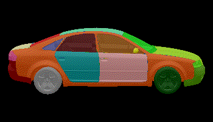
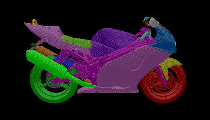
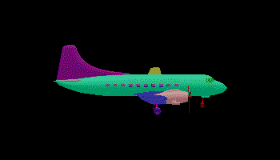
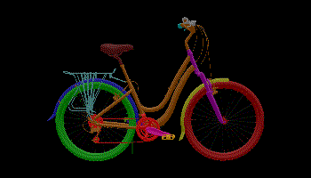
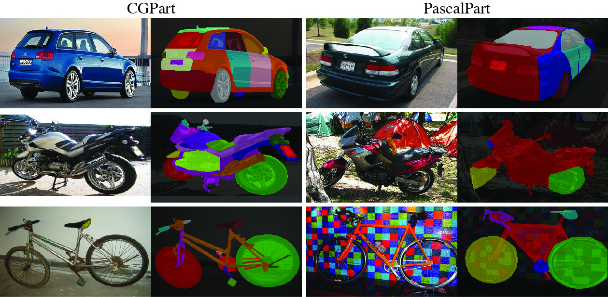

## CGPart: A Part Segmentation Dataset Based on 3D Computer Graphics Models

CGPart is a comprehensive part segmentation dataset that provides detailed annotations on 3D CAD models, synthetic images, and real test images. Below are some example segmentation annotations from the dataset. More detailed descriptions and experimental results of using CGPart as a benchmark for unsupervised domain adapatation for part segmentation could be found in the [paper](https://arxiv.org/abs/2103.14098).  


### Part Annotation on 3D CAD Models [[Download](https://cs.jhu.edu/~qliu24/CGPart/cgpart_3d.zip)]
CGPart is composed of 3D CAD models from 5 vehicle categories: *car*, *motorbike*, *aeroplane*, *bus*, and *bicycle*. For each category, we select 4 to 5 high-quality 3D CAD models from ShapeNetCore [1]. Each CAD model represents a common prototype (i.e., subtype) of the category it belongs to. In total, we select 21 CAD models to be included and annotated in CGPart. Below are some example part annotations on 3D CAD models.  
  
   
  
 

### Part Annotation on Synthetic Images [Download]
Based on the CAD models and their part annotations, we render a large-scale synthetic image dataset with automatically generated part segmentation ground-truth. We use Blender as our renderer and randomize the parameters, including lighting, background, object texture, and viewpoint, to enable nuisance factor control and facilitate domain generalization. Example code could be found at [here]. 

### Part Annotation on Real Test Images [[Download](https://cs.jhu.edu/~qliu24/CGPart/cgpart_real.zip)]
CGPart also provides part segmentations on 200 real vehicle images (40 images per category) for evaluation purposes. The images are carefully selected from PASCAL3D+ dataset [3] to contain high-resolution and non-occluded objects from various subtypes and evenly distributed viewpoints. We use the VGG Image Annotator to manually label the parts on the images. Below are some example part annotations on real test images and comparisons with PascalPart [4]. For original uncropped images, please download from the [PASCAL3D+](https://cvgl.stanford.edu/projects/pascal3d.html) website.  


### Citation
If you find this project helpful, please consider citing our paper.
```
@article{liu2019semantic,
  author    = {Liu, Qing and Kortylewski, Adam and Zhang, Zhishuai and Li, Zizhang and Guo, Mengqi and Liu, Qihao and Yuan, Xiaoding and Mu, Jiteng and Qiu, Weichao and Yuille, Alan},
  title     = {CGPart: A Part Segmentation Dataset Based on 3D Computer Graphics Models},
  journal   = {arXiv preprint arXiv:2103.14098},
  year      = {2021},
}
```
### References
[1] Chang, Angel X., et al. "Shapenet: An information-rich 3d model repository." arXiv preprint arXiv:1512.03012 (2015).  
[2] Community, B. O. (2018). "Blender - a 3D modelling and rendering package." Stichting Blender Foundation, Amsterdam. Retrieved from http://www.blender.org.  
[3] Xiang, Yu, Roozbeh Mottaghi, and Silvio Savarese. "Beyond pascal: A benchmark for 3d object detection in the wild." IEEE winter conference on applications of computer vision. IEEE, 2014.  
[4] Chen, Xianjie, et al. "Detect what you can: Detecting and representing objects using holistic models and body parts." IEEE conference on computer vision and pattern recognition. 2014.
